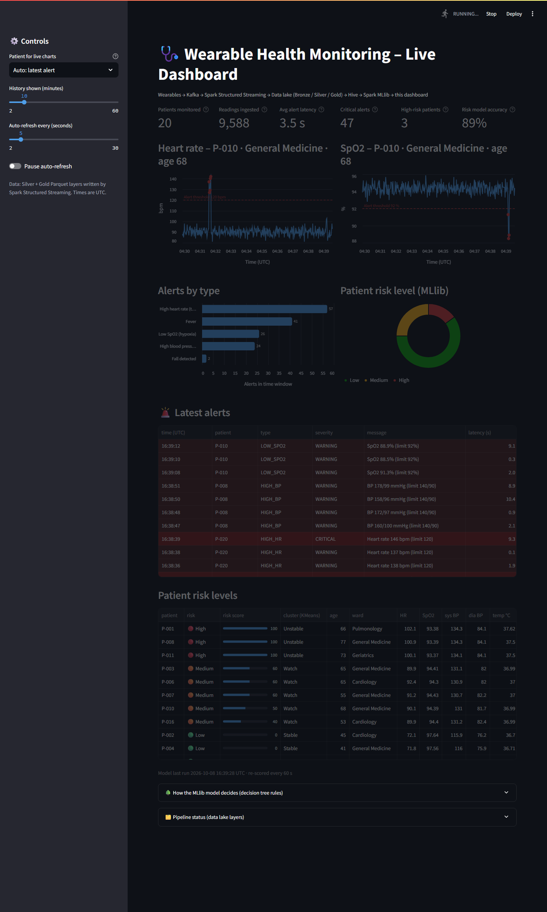
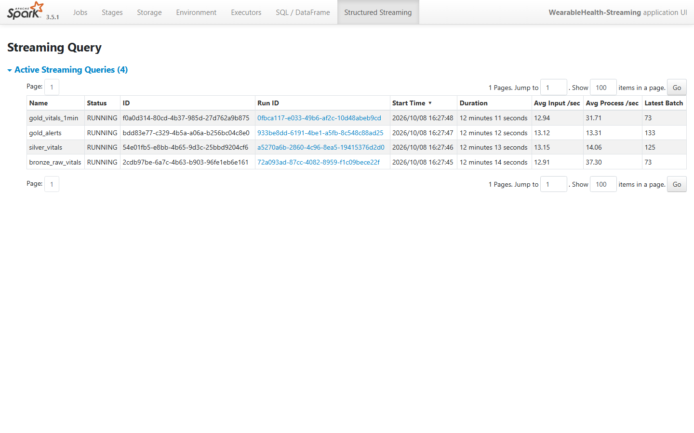
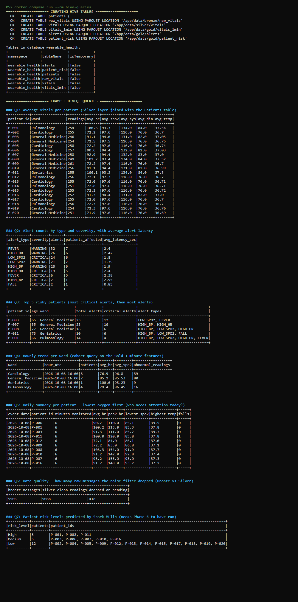

# Healthcare – Wearable Device Health Monitoring

A working Big Data mini-project that follows the architecture in our slides, end to end:

```
Wearables ─► (MQTT) ─► Kafka ─► Spark Structured Streaming ─► Data lake Bronze / Silver / Gold (Parquet)
                                                                   │
                                        Dashboard ◄─ Spark MLlib ◄─┴─► Hive (HiveQL)
```

20 simulated patients send heart rate, SpO2, blood pressure, temperature, steps and fall events every 1–2 s. Kafka ingests the stream. Spark cleans it, raises threshold alerts within seconds and builds 1-minute patient features. Hive queries the lake, an MLlib decision tree labels every patient Low / Medium / High risk, and a live dashboard shows it all.

**Pinned versions (chosen to work together):** Apache Spark / PySpark **3.5.1** (Scala 2.12) · Java **17** · Kafka connector `spark-sql-kafka-0-10_2.12:3.5.1` + `kafka-clients 3.4.1` · Apache Kafka **3.7.1** (KRaft) · Python **3.10** · Streamlit 1.39 · Mosquitto 2.0.18. All run inside Docker, so the same commands work on **Windows and Mac**, and you don't install Java or Spark yourself. Peak memory is about 4 GB, so it fits an 8 GB laptop.

## Project status

| Phase | What | Status |
|---|---|---|
| 1 | Project setup (folders, requirements, .gitignore) | ✅ done |
| 2 | Kafka with Docker Compose | ✅ done |
| 3 | Wearable data simulator (+ optional MQTT path) | ✅ done |
| 4 | Spark Structured Streaming + Bronze/Silver/Gold | ✅ done |
| 5 | Hive queries | ✅ done |
| 6 | Spark MLlib risk model | ✅ done |
| 7 | Streamlit dashboard | ✅ done |
| 8 | Final docs + viva questions | ✅ done |

> **Verification note:** the full Docker pipeline has been run end to end on a Windows 11 laptop (Docker Desktop on WSL 2): build, generator + Kafka, Spark streaming (Bronze/Silver/Gold all filled), the MLlib risk model, the dashboard on http://localhost:8501 and all 7 HiveQL queries. The logic tests (`tests/test_logic.py`) pass. Screenshots from that run are in the *Screenshots* section below.

## Folder structure

```
wearable-health-monitoring/
├── common/settings.py              shared paths, Kafka topic, alert thresholds, risk-score rules
├── generator/wearable_simulator.py wearable devices (20 patients) -> Kafka (or MQTT)
├── ingestion/mqtt_to_kafka_bridge.py   optional MQTT -> Kafka forwarder
├── ingestion/mosquitto.conf        optional MQTT broker settings
├── spark/streaming_job.py          Spark Structured Streaming: Kafka -> Bronze / Silver / Gold
├── spark/check_layers.py           prints row counts + samples of every layer
├── hive/create_tables.hql          Hive external tables over the data lake
├── hive/queries.hql                7 example HiveQL queries
├── hive/run_hive_queries.py        runs the two .hql files through Spark's Hive support
├── ml/risk_model.py                Spark MLlib decision tree (Low/Medium/High) + KMeans clusters
├── dashboard/app.py                Streamlit live dashboard
├── dashboard/cloud_app.py          online copy of the dashboard (replays demo_data/)
├── demo_data/                      recorded pipeline output used by the online dashboard
├── tests/test_logic.py             logic tests (simulator, thresholds, risk score) - no Spark needed
├── docker-compose.yml              starts every service
├── Dockerfile                      one image: Spark 3.5.1 + Java 17 + Python libs + Kafka connector
├── requirements.txt                pinned Python libraries
├── .streamlit/config.toml          dashboard theme
├── docs/screenshots/               put your dashboard screenshots here
└── data/                           the data lake (created at runtime, NOT committed to git)
    ├── bronze/raw_vitals/          raw JSON from Kafka
    ├── silver/vitals/              cleaned readings
    ├── gold/alerts/  gold/vitals_1min/  gold/patient_risk/  gold/model_metrics.json
    ├── reference/patients/         patient master list (CSV)
    ├── checkpoints/                Spark streaming checkpoints
    └── models/                     saved MLlib model
```

## Before you start (one-time setup)

You only need **two programs** on your laptop. Everything else (Java 17, Spark 3.5.1, Kafka, Python libraries) runs inside Docker, so the steps are the same on Windows and Mac.

1. **Docker Desktop** – https://www.docker.com/products/docker-desktop/
   - Windows: during install keep "Use WSL 2" ticked. Restart when asked.
   - Mac: pick the Apple-chip or Intel download that matches your Mac.
   - Open Docker Desktop and wait until it says **"Engine running"**.
   - RAM: *Settings → Resources* (Windows with WSL 2 manages this automatically). Give Docker **at least 4 GB** – 6 GB is comfortable on a 16 GB laptop.
2. **Git** – https://git-scm.com/downloads (Mac: run `git --version` once and accept the install prompt).

Open a terminal (**Windows: PowerShell**, **Mac: Terminal**) and go into the project folder:

```bash
cd wearable-health-monitoring
```

All commands below are typed in that folder. They are identical on Windows and Mac.


## ▶️ Run the demo (the short version)

First time only: do the **one-time setup** above, then build the image (5–10 min):

```bash
docker compose build
```

Then, in this order:

```bash
# 1. Start Docker Desktop and wait for "Engine running"

# 2. Start Kafka + the wearable generator (Kafka starts automatically first)
docker compose up -d generator

# 3. Start the Spark streaming job (Kafka -> Bronze / Silver / Gold)
docker compose up -d spark-streaming

#    ...wait about 3 minutes so Spark can write some 1-minute windows...

# 4. Start the MLlib risk model (re-scores every 60 s)
docker compose up -d ml

# 5. Start the dashboard, then open http://localhost:8501
docker compose up -d dashboard
```

Optional, during the viva:

```bash
docker compose run --rm hive-queries                          # Hive tables + 7 HiveQL queries
docker compose exec spark-streaming spark-submit spark/check_layers.py   # Bronze/Silver/Gold counts
docker compose run --rm ml-once                               # print the decision-tree rules + accuracy
docker compose logs -f generator                              # watch readings / abnormal episodes
```

Spark UI (live streaming statistics): http://localhost:4040 → *Structured Streaming* tab.

**Stop** (keeps all data): `docker compose stop`  ·  **Start again**: `docker compose start`

**Full reset** (delete all data and start fresh). Always delete the data folders *and* the Docker volumes together, otherwise Spark's checkpoints won't match Kafka:

```bash
docker compose down -v
```

then delete the folders inside `data/`:

- Windows (PowerShell): `Remove-Item -Recurse -Force data\bronze, data\silver, data\gold, data\checkpoints, data\models, data\reference`
- Mac: `rm -rf data/bronze data/silver data/gold data/checkpoints data/models data/reference`


## How it works – code files mapped to the PPT architecture

| # | PPT layer (slide 4) | PPT component | Code file / service | What it does here |
|---|---|---|---|---|
| 1 | Wearable devices | Smartwatch / band, ECG patch, BP cuff, smartphone BLE gateway | `generator/wearable_simulator.py` (service `generator`) | 20 virtual patients (60 % Low, 25 % Medium, 15 % High risk profiles). Each sends a JSON reading every 1–2 s. Short abnormal episodes (tachycardia, hypoxia, hypertension, fever, fall) and ~0.4 % deliberately invalid readings. |
| 2 | Ingestion | MQTT broker | `ingestion/mosquitto.conf`, `ingestion/mqtt_to_kafka_bridge.py` (profile `mqtt`) | Optional: devices publish to `wearables/<patient>/vitals`, and the bridge forwards to Kafka. |
| 2 | Ingestion | Apache Kafka, "vitals" topic, per-patient partitions | `docker-compose.yml` → `kafka`, `kafka-init` | Kafka 3.7.1 in KRaft mode. Topic `vitals` with 3 partitions. Messages are keyed by `patient_id`, so each patient's readings stay in order on one partition. |
| 3 | Big Data platform | Spark Structured Streaming: noise filter, missing values, 1-min windows, real-time threshold rules | `spark/streaming_job.py` (service `spark-streaming`) | 4 streaming queries: **Bronze** raw copy · **Silver** parse + drop invalid/missing + de-duplicate · **Gold alerts** threshold rules with severity + latency · **Gold vitals_1min** 1-minute averages per patient with a 1-minute watermark. |
| 3 | Big Data platform | HDFS data lake Bronze / Silver / Gold, Parquet, partitioned by date | `data/bronze`, `data/silver`, `data/gold` (paths in `common/settings.py`) | Same layered Parquet lake, partitioned by date, in local folders (see *What we replaced*). |
| 3 | Big Data platform | Apache Hive: Patients, Vitals, Alerts tables; daily / weekly, trend & cohort queries | `hive/create_tables.hql`, `hive/queries.hql`, `hive/run_hive_queries.py` (services `hive-queries`, `hive-shell`) | External Hive tables `patients, raw_vitals, vitals, vitals_1min, alerts, patient_risk` in database `wearable_health`. 7 HiveQL queries cover per-patient averages, alert counts, top risky patients, hourly ward trend, daily summary, data quality and risk mix. |
| 4 | Analytics | Anomaly detection (tachycardia, low SpO2, high BP, falls) | `alerts_layer()` in `spark/streaming_job.py`, thresholds in `common/settings.py` | Rule-based detection on every reading: HR > 120, SpO2 < 92, BP > 140/90, temp > 38 °C, fall. CRITICAL above a second, stricter limit. |
| 4 | Analytics | Spark MLlib: health-risk score, patient clustering | `ml/risk_model.py` (services `ml`, `ml-once`) | Decision tree (depth 4) → Low / Medium / High per patient + 0–100 risk score. KMeans (k = 3) → Stable / Watch / Unstable clusters. Results go to Gold `patient_risk`. |
| 5 | Visualization | Grafana / Superset doctor dashboard: live vitals panels, alert notifications | `dashboard/app.py` (service `dashboard`) | Streamlit page, auto-refreshing: KPI cards, live HR & SpO2 with thresholds, alerts by type, risk donut, red alerts table, patient risk table. |
| – | (all) | shared configuration | `common/settings.py` | One place for paths, topic name, alert thresholds and risk-score bands. Spark, ML, dashboard and tests all use it. |

**Data flow of one reading:** the simulator creates `{"patient_id":"P-017","heart_rate":131,...}` → Kafka topic `vitals` (key `P-017`) → Spark writes the raw JSON to **Bronze**. It parses and validates the reading → **Silver**. HR 131 > 120 raises a `HIGH_HR` WARNING → **Gold alerts**, about 2 s after the reading. At the end of the minute, P-017's averages → **Gold vitals_1min**. The ML job labels P-017's recent minutes → **Gold patient_risk**. The dashboard reads Silver + Gold every 5 s.

## What we replaced or simplified (and what to say in the viva)

| In the PPT | In this working model | One line for the viva |
|---|---|---|
| HDFS cluster (Bronze/Silver/Gold) | **Local folders** `data/bronze`, `data/silver`, `data/gold` (same Parquet files, same date partitions) | "HDFS needs a NameNode and DataNodes, which is too heavy for a laptop. Spark writes through the same Hadoop FileSystem API, so moving to HDFS only means changing the path to `hdfs://`." |
| Apache Hive server | **Spark SQL with Hive support** (Hive metastore + HiveQL, run by Spark) | "We use Hive's metastore and HiveQL through Spark's built-in Hive support, instead of running a separate HiveServer2, which needs several extra GB of RAM." |
| Grafana / Apache Superset | **Streamlit** dashboard | "Grafana and Superset need a database connector and a separate server. Streamlit reads the same Gold tables in Python, so the demo stays light. In production, Grafana would connect to the same Hive tables." |
| MQTT broker → Kafka | Default: the simulator acts as the **smartphone gateway and publishes straight to Kafka**. The full MQTT path is **included as an option** (`--profile mqtt`). | "The MQTT hop is implemented and can be switched on. By default the gateway publishes directly to Kafka to keep the demo simple." |
| Isolation Forest (anomaly detection) | **Threshold rules** for alerts + an MLlib **decision tree** for risk | "Isolation Forest isn't part of Spark MLlib, so we used clinical threshold rules for real-time anomalies and an explainable MLlib decision tree for risk." |
| REST / FHIR API, mobile app alerts | Not built | "FHIR integration with hospital EHRs is listed as future enhancement." |
| Glucose (CGM), ECG waveform, sleep data | Not simulated. We simulate HR, SpO2, BP, temperature, steps and fall events. | "We focused on the vital signs that drive our alert rules. ECG arrhythmia detection is future work." |
| Security bar (TLS, Kerberos, Ranger, encryption) | Not enabled in the local demo | "Security is designed in the architecture, but in a local demo we run without authentication." |
| Result slide: 50 patients, "Anomaly model recall 92 %" | 20 patients by default; the dashboard shows **model accuracy** | "The cohort size is a parameter." To match the slide, change `--patients 20` to `--patients 50` in `docker-compose.yml`. |
| Zookeeper (not in slides) | Kafka **KRaft** mode, no Zookeeper | "Kafka 3.x can manage its own metadata (KRaft), which saves memory." |

> ⚠️ **Slide 8 (Result)** is titled *"Live Dashboard (Grafana)"*. Either change that caption to "Streamlit", or use the Grafana line above if you're asked.

## 10 likely viva questions (with short answers from this code)

1. **Why put Kafka between the wearables and Spark?**
   Kafka is a durable buffer. Devices keep sending even if Spark is slow or restarting, and Spark can replay from saved offsets. The `vitals` topic has 3 partitions and messages are keyed by `patient_id`, so each patient's readings stay in order and the load spreads across partitions.

2. **What is Spark Structured Streaming and how often does it run?**
   It treats the Kafka stream as an ever-growing table and processes it in small micro-batches. Our triggers are every 3 s (alerts), 5 s (Silver), and 10 s (Bronze and 1-minute windows). Checkpoints in `data/checkpoints/` store the Kafka offsets, so after a restart it continues where it stopped, with no duplicates in the Parquet output.

3. **What is the difference between Bronze, Silver and Gold?**
   Bronze holds the raw Kafka message, untouched (`raw_json`), so we can always re-process. Silver holds parsed, typed, validated and de-duplicated readings. Gold holds business-ready data: alerts, 1-minute patient features and ML risk levels. All are Parquet, partitioned by date.

4. **How do you handle noisy or invalid sensor data?**
   `parse_and_clean()` drops readings with missing fields, impossible values (HR outside 30–220, SpO2 outside 70–100, temperature outside 34–42 °C, systolic ≤ diastolic) or bad timestamps. The simulator sends about 0.4 % broken readings on purpose. Hive query Q6 compares Bronze and Silver counts to show how many were dropped.

5. **What is a watermark?**
   It tells Spark how long to wait for late readings. We use 1 minute for the window aggregation: a 1-minute window is finalised and written once the stream's event time has moved 1 minute past its end. Readings later than that are ignored. That's why the windows appear about 2 minutes after start.

6. **How are alerts generated, and how fast?**
   Every clean reading is checked against the rules in `common/settings.py`: HR > 120, SpO2 < 92, BP > 140/90, temperature > 38 °C, fall detected. A second, stricter limit (e.g. HR > 140, SpO2 < 88) makes it CRITICAL. We store `latency_sec` = alert time − reading time, usually 1–3 s, and it's shown as a KPI card.

7. **Why Parquet, and why partition by date?**
   Parquet is columnar and compressed, so a query like "average heart rate" reads only that column. Date partitions (`event_date=2026-10-08/`) let Hive and Spark skip the days a query doesn't need.

8. **Where is Hive in your project?**
   `hive/create_tables.hql` registers the lake folders as external Hive tables in the Hive metastore (database `wearable_health`). External means dropping a table never deletes the data. We run HiveQL through Spark's Hive support. You can also run queries live with `docker compose run --rm hive-shell`.

9. **How does your ML model work, and why is its accuracy so high?**
   Each 1-minute window is labelled with an early-warning score (like NEWS2: points for each abnormal vital; 0–1 Low, 2–3 Medium, 4+ High). An MLlib `DecisionTreeClassifier` (depth 4) learns those labels from 8 features, trained on 80 % and tested on 20 %. Accuracy is close to 100 % because the labels come from rules on the same features: the tree learns a compact, explainable version of the clinical score. With real doctor-labelled outcomes the same pipeline would simply be retrained on those labels. The patient's level is the majority vote of their last 5 minutes. KMeans (k = 3) groups patients into Stable / Watch / Unstable.

10. **How would this scale to thousands of patients?**
    Add Kafka partitions and brokers, run Spark on a cluster (YARN or Kubernetes) instead of `local[2]`, and store the lake on HDFS or cloud storage. The code stays the same: only the Kafka address, the Spark master and the data path change (all in `common/settings.py` / environment variables).

## Online demo (works with the laptop off)

Kafka and Spark can't run on a free web host, so the online copy of the dashboard is a **recorded replay**: `dashboard/cloud_app.py` starts the normal dashboard in replay mode, and it plays back a 14-minute recording of real pipeline output (`demo_data/`) in a loop on the current clock. Charts move and alerts appear just like the live version, and a banner on the page says it is a replay.

Hosted free on **Streamlit Community Cloud**:

1. Sign in at https://share.streamlit.io with your GitHub account.
2. **Create app** → *Deploy a public app from GitHub* → repository `Jeshwanth-tkd/wearable-health-monitoring`, branch `main`, main file path **`dashboard/cloud_app.py`**.
3. *Advanced settings* → Python **3.12** → **Deploy**. It installs `dashboard/requirements.txt` and is online in about 2 minutes.

To record fresh data for the online copy, run the pipeline for 10+ minutes, then:

```bash
docker compose exec dashboard python3 dashboard/export_replay_data.py
```

and commit + push `demo_data/`. Streamlit Cloud redeploys automatically.

## Screenshots

Taken from a real end-to-end run (20 patients, about 12 minutes of streaming).

**Live dashboard** (http://localhost:8501) – KPI cards, live heart-rate and SpO2 charts with alert thresholds, alerts by type, MLlib risk donut, latest alerts and patient risk table:



**Spark UI – Structured Streaming tab** (http://localhost:4040) – the four streaming queries (Bronze, Silver, Gold alerts, Gold 1-minute windows) all running:



**Hive** – `docker compose run --rm hive-queries` creating the tables and printing the 7 example HiveQL queries:



## Troubleshooting

| Problem | Fix |
|---|---|
| `docker: command not found` / "cannot connect to the Docker daemon" | Open Docker Desktop and wait for *Engine running*. |
| `port is already allocated` (9092, 8501, 4040 or 1883) | Another program uses that port. Close it, or change the left-hand number in `ports:` in `docker-compose.yml`. |
| Build fails while downloading | Check your internet connection and run `docker compose build` again. |
| A container shows `Exited (137)` | Out of memory. Give Docker more RAM, and don't run `hive-queries`/`ml-once` while `ml` is also running. |
| Dashboard keeps saying "Waiting for data" | `docker compose ps` – are `generator` and `spark-streaming` running? Check `docker compose logs spark-streaming`. |
| Risk donut / risk table empty | The ML job needs ~40 one-minute windows (≈ 3 min). Check `docker compose logs ml`. |
| `hive-queries` says SKIP for a table | That layer has no data yet (e.g. `patient_risk` before the ML job). Let the pipeline run longer. |
| Strange errors after resetting Kafka | Do the **full reset** above: delete the `data/` folders *and* run `docker compose down -v`. |
| Windows: Spark is slow to write files | Keep the project folder on the C: drive, not in OneDrive. |

## Push this project to GitHub

The git history already has one commit per phase. Create an **empty** repository named `wearable-health-monitoring` on GitHub (no README, no .gitignore), then in this folder:

```bash
git remote add origin https://github.com/<your-username>/wearable-health-monitoring.git
git push -u origin main
```

The `.gitignore` keeps `data/`, Spark checkpoints, the Hive metastore, virtual environments and `.env` files out of git.

## Detailed step-by-step (phase by phase)

Use this section the first time, to check that each part works on its own.


### Phase 2 – Start Kafka

```bash
docker compose up -d kafka kafka-init
```

The first time, this downloads the Kafka image (~400 MB). Check it worked:

```bash
docker compose ps                 # "kafka" should show (healthy)
docker compose logs kafka-init    # should print: Topic: vitals  PartitionCount: 3
```

List the topics yourself:

```bash
docker compose exec kafka /opt/kafka/bin/kafka-topics.sh --bootstrap-server kafka:29092 --list
```

Expected output: `vitals`

Stop everything (keeps the data) with `docker compose stop`; start again with `docker compose start`.

### Phase 3 – Start the wearable simulator

Builds our app image (first time only, ~5–10 min: it downloads Spark 3.5.1 + Java 17 + Python libraries), then starts streaming 20 patients into Kafka:

```bash
docker compose up -d --build generator
docker compose logs -f generator        # Ctrl+C to stop watching (the generator keeps running)
```

You should see lines like:

```
[simulator] connected to Kafka at kafka:29092, topic 'vitals'
[simulator] streaming 20 patients every 1-2 s. Press Ctrl+C to stop.
[simulator] !! P-017: abnormal episode started -> tachycardia
[simulator] sent 1320 readings so far (3 abnormal episodes, 5 invalid)
```

Read 5 messages straight from the Kafka topic to prove they arrived:

```bash
docker compose exec kafka /opt/kafka/bin/kafka-console-consumer.sh --bootstrap-server kafka:29092 --topic vitals --max-messages 5
```

Each message looks like:

```json
{"patient_id": "P-007", "device_id": "DEV-007", "timestamp": "2026-10-08 04:02:05.496", "heart_rate": 94, "spo2": 94.2,
 "systolic_bp": 132, "diastolic_bp": 83, "body_temp": 37.2, "steps": 1757, "fall_detected": false}
```

Run the logic tests (no Kafka needed):

```bash
docker compose run --rm generator python3 -m unittest tests/test_logic.py -v
```

**Optional – full MQTT path from the PPT** (smartphone → MQTT broker → Kafka). Use this *instead of* the normal generator:

```bash
docker compose stop generator
docker compose --profile mqtt up -d mosquitto mqtt-bridge generator-mqtt
docker compose logs -f mqtt-bridge      # "forwarded 500 messages MQTT -> Kafka"
```

### Phase 4 – Start the Spark streaming job (Bronze / Silver / Gold)

> **Storage note:** HDFS in Docker needs a NameNode + DataNode (~2 GB extra RAM) and often breaks on laptops because the DataNode's hostname isn't reachable from outside Docker. For reliability **we use local folders `data/bronze`, `data/silver`, `data/gold` instead of HDFS.** The layout, Parquet format and date partitioning are the same as in the PPT. Spark writes through the Hadoop FileSystem API either way, so on a real cluster only the path changes (`hdfs://...`).

```bash
docker compose up -d spark-streaming
docker compose logs -f spark-streaming
```

After ~30 seconds you'll see a status line every 30 s:

```
[streaming] bronze_raw_vitals  batch=12     rows_in_last_batch=131    status=Waiting for next trigger
[streaming] silver_vitals      batch=25     rows_in_last_batch=66     status=Waiting for next trigger
[streaming] gold_alerts        batch=41     rows_in_last_batch=39     status=Waiting for next trigger
[streaming] gold_vitals_1min   batch=12     rows_in_last_batch=131    status=Waiting for next trigger
```

Folders now appear in your project's `data/` folder:

```
data/bronze/raw_vitals/ingest_date=2026-10-08/part-....parquet   raw JSON from Kafka
data/silver/vitals/event_date=2026-10-08/...                     cleaned readings
data/gold/alerts/event_date=2026-10-08/...                       threshold alerts
data/gold/vitals_1min/event_date=2026-10-08/...                  1-minute averages per patient
data/checkpoints/...                                             Spark's progress bookmarks
```

Check every layer (counts, sample rows, alerts by type):

```bash
docker compose exec spark-streaming spark-submit spark/check_layers.py
```

The 1-minute windows appear about **2 minutes** after start. That's because a window is only written once it is closed: its minute must end, plus the 1-minute watermark for late readings.

Spark UI: open http://localhost:4040 → **Structured Streaming** tab to see input rate and batch durations (nice for the viva).

### Phase 5 – Query the data lake with Hive (HiveQL)

> **Hive note:** a full Hive install (HiveServer2 + metastore database) needs several GB of extra RAM. We use **Spark SQL with Hive support**: it's the same Hive metastore and the same HiveQL, run by Spark. The metastore is a small Derby database kept in a Docker volume.

With the generator and streaming job still running (let them run 3+ minutes first):

```bash
docker compose run --rm hive-queries
```

This registers 6 external Hive tables in database `wearable_health`:

| Hive table | Layer | Data folder |
|---|---|---|
| `patients` | reference | `data/reference/patients/` (CSV) |
| `raw_vitals` | Bronze | `data/bronze/raw_vitals/` |
| `vitals` | Silver | `data/silver/vitals/` |
| `vitals_1min` | Gold | `data/gold/vitals_1min/` |
| `alerts` | Gold | `data/gold/alerts/` |
| `patient_risk` | Gold | `data/gold/patient_risk/` (after Phase 6) |

Then it runs the example queries in `hive/queries.hql`:

1. Average vitals per patient
2. Alert counts by type and severity (+ average alert latency)
3. Top 5 risky patients
4. Hourly trend per ward (cohort query)
5. Daily summary per patient – lowest SpO2 first
6. Data quality: Bronze vs Silver row counts (readings dropped by the noise filter)
7. Patient risk levels from MLlib (shows "skipped" until Phase 6 has run)

Interactive Hive prompt (type a query ending with `;`, `exit;` to quit):

```bash
docker compose run --rm hive-shell
spark-sql (wearable_health)> SELECT alert_type, COUNT(*) FROM alerts GROUP BY alert_type;
```

Run `hive-queries` and `hive-shell` one at a time (the Derby metastore allows one user at a time).

### Phase 6 – Spark MLlib risk model (Low / Medium / High)

Wait until the streaming job has produced at least ~40 one-minute windows (about 3 minutes with 20 patients). Then run the model once to see the full report:

```bash
docker compose run --rm ml-once
```

It prints:

- the label mix and **test accuracy / F1**
- **feature importance** (which vital signs matter most)
- the **decision tree as IF/ELSE rules**, e.g. `If (avg_spo2 <= 94.97) ... Predict: Medium`
- a table of every patient's **risk level, risk score (0–100) and cluster group**

For the live demo, keep it re-scoring every 60 seconds in the background:

```bash
docker compose up -d ml
docker compose logs -f ml
```

Outputs: `data/gold/patient_risk/` (Parquet, also the Hive table `patient_risk`), `data/gold/model_metrics.json`, and the saved model in `data/models/risk_decision_tree/`.

How the model works (simple version for the viva):

1. **Labels:** each 1-minute window gets points from an early-warning score (like the NHS NEWS2 score). Each vital outside its normal band adds points: 0–1 → Low, 2–3 → Medium, 4+ → High.
2. **Model:** a `DecisionTreeClassifier` (depth 4) learns to predict that label from `avg_hr, max_hr, avg_spo2, min_spo2, avg_sys, avg_dia, avg_temp, falls`. The data is split 80/20 into train and test.
3. **Patient level:** majority vote of the patient's last 5 minutes, so one noisy minute doesn't flip it.
4. **Clustering:** KMeans (k = 3) on each patient's average vitals → *Stable / Watch / Unstable* groups.

### Phase 7 – Live dashboard (Streamlit)

```bash
docker compose up -d dashboard
```

Open **http://localhost:8501** in your browser. The page refreshes itself every 5 seconds (change it, or pause it, in the left sidebar). It shows:

- **KPI cards:** patients monitored, readings ingested, average alert latency, critical alerts, high-risk patients, model accuracy
- **Live heart-rate and SpO2 charts** for one patient, with the red dashed alert threshold (120 bpm / 92 %). Readings that cross it are red dots. *Auto: latest alert* follows whichever patient alarmed last.
- **Alerts by type** bar chart and the **MLlib risk-level donut** (Low / Medium / High)
- **Red alerts table** – newest first, CRITICAL rows darker red
- **Patient risk table** – risk level, risk score bar, KMeans cluster, average vitals
- Expanders: **decision-tree rules** and **pipeline status**, which shows the Parquet file and row counts per Bronze/Silver/Gold layer
